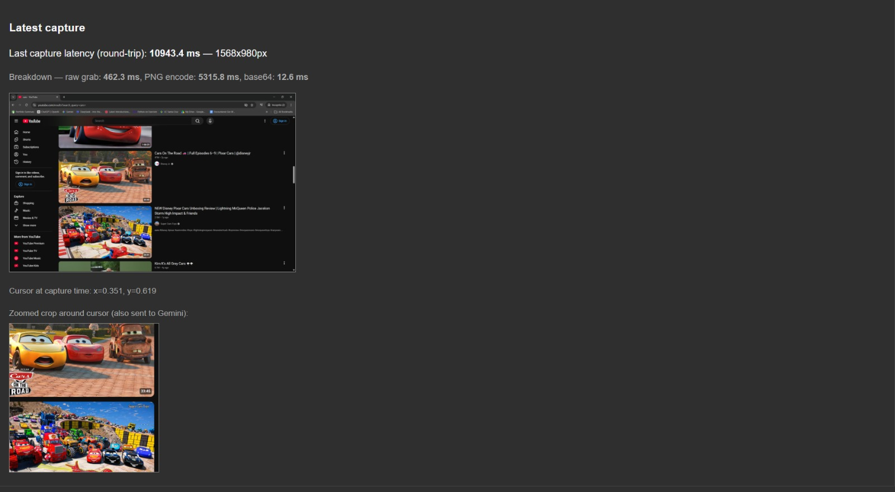
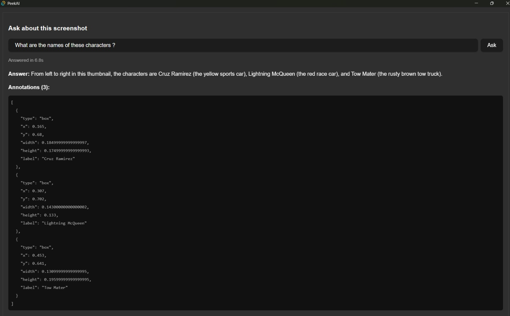
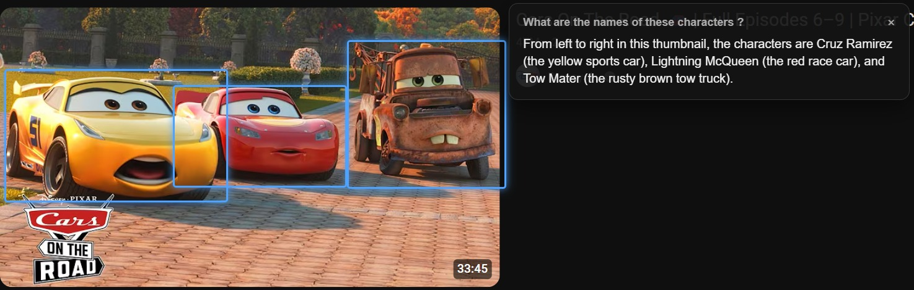
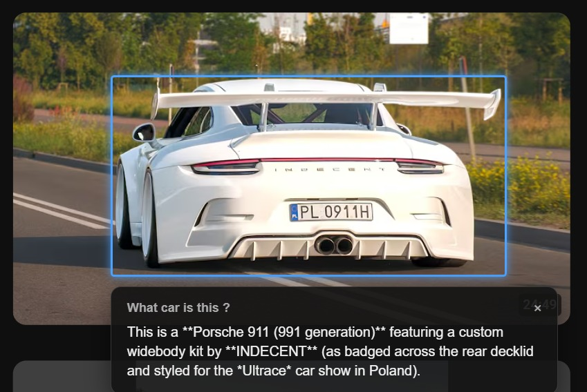

# PeekAI

A Windows desktop app (Tauri + React/TypeScript + Rust) that lets you hotkey-capture
your screen, ask a question about what's on it, and get back a spoken-language answer
plus visual annotations (rings/boxes/arrows/underlines) drawn directly on screen.

> **Windows only.** The backend calls Win32 APIs directly (`GetCursorPos`,
> `GetForegroundWindow`, Windows Credential Manager) and is not portable to
> macOS/Linux as-is — see [ARCHITECTURE.md](ARCHITECTURE.md) for why.

## Screenshots

**Main window** — after a hotkey capture: the screenshot, a cursor-centered
detail crop, and the capture-latency breakdown.



**Query panel** — asking a question about the capture and getting back a
plain-text answer plus the raw annotation coordinates.



**Overlay in action** — annotations drawn directly over the real screen,
with the draggable chat card showing the answer.



**Overlay, single annotation** — a focused example pointing out one
on-screen subject.



## Prerequisites

- **Windows 10/11**
- **[Node.js](https://nodejs.org/) 20+** and npm
- **[Rust](https://rustup.rs/)** (stable toolchain) via rustup
- **Tauri's native build tools**: the Microsoft C++ Build Tools ("Desktop
  development with C++" workload in Visual Studio Installer) and the WebView2
  Runtime (preinstalled on most Windows 10/11 machines). Full list:
  [tauri.app/start/prerequisites](https://tauri.app/start/prerequisites/)
- A **Gemini API key** — create one for free at
  [aistudio.google.com/apikey](https://aistudio.google.com/apikey)

## Setup

```sh
git clone <this-repo-url>
cd <cloned-folder-name>
npm install
npm run tauri dev
```

The first `npm run tauri dev` will take a while (compiling the Rust
dependency tree); subsequent runs are fast. On first launch the app prompts
for your Gemini API key — it's stored in the Windows Credential Manager, not
in a `.env` file or any project file, so there is nothing else to configure.
Press **Ctrl+Space** from any app to capture the screen and open the query
panel.

## How it works

See [ARCHITECTURE.md](ARCHITECTURE.md) for the full breakdown. Short version:

```
Global hotkey (Rust: tauri-plugin-global-shortcut)
        |
        v
capture_screen (Rust command)
  - Privacy Guard check (src-tauri/src/privacy.rs) -- blocks capture if the
    foreground window looks like a password manager or banking site
  - xcap grabs the primary monitor into memory (never written to disk)
  - a cursor-centered crop is taken from the full-resolution image for detail
  - the full screenshot is downscaled (src-tauri/src/lib.rs::downscale_for_vlm)
    before being base64-encoded, to bound payload size/latency on 4K+ displays
        |
        v
analyze_screenshot (Rust command, src-tauri/src/vlm.rs)
  - builds a prompt from the query, cursor position, and per-app conversation
    history (src-tauri/src/memory.rs, in-memory only, never persisted)
  - calls the Gemini API directly with the screenshot(s) + a JSON response
    schema (text + annotations[])
  - normalizes Gemini's box_2d coordinates into 0-1 screen fractions
        |
        v
show_overlay (Rust command, src-tauri/src/overlay.rs)
  - shows a transparent, click-through, always-on-top window covering the
    primary monitor (declared statically in tauri.conf.json -- see the doc
    comment on ensure_overlay_window for why it isn't built dynamically)
  - the frontend (src/components/Overlay.tsx) draws annotation markers and a
    draggable chat card with the answer
  - a background thread polls the real cursor position
    (spawn_overlay_cursor_poll in lib.rs) to toggle click-through on/off
    depending on whether the cursor is over the chat card, since Windows
    routes all mouse input away from a click-through window
```

## Privacy / telemetry

- The only outbound network calls are to `generativelanguage.googleapis.com`
  (the user's own Gemini API key, sent directly from the Rust backend -- it
  never crosses the IPC bridge to the frontend). There is no analytics,
  crash-reporting, or telemetry SDK anywhere in the dependency tree.
- Screenshots are never written to disk; conversation history is kept
  in-memory only, capped at 10 turns per foreground app, and cleared on
  restart.
- The Privacy Guard (`src-tauri/src/privacy.rs`) blocks capture outright when
  the foreground window's process name or title matches a denylist of
  password managers / banking / 2FA keywords.

## Extending it

**Adding a new annotation shape:** annotations flow from Gemini's
`box_2d`/`type` fields (`src-tauri/src/vlm.rs::RawAnnotation`) through the
normalized `Annotation` type (`src/types.ts`) to
`src/components/Overlay.tsx::AnnotationMarker`, which switches on
`annotation.type` to pick a CSS class from `src/components/Overlay.css`. Add
the new variant to the `type` union in `types.ts`, the schema enum in
`vlm.rs::response_schema`, and a rendering case + CSS class for it.

**Adding a new VLM provider:** the pipeline is currently Gemini-only
(`src-tauri/src/vlm.rs` talks to Gemini's API directly) rather than behind a
provider trait, since only one provider is implemented today. To add a
second one, introduce a trait once there's a real second implementation to
justify it (e.g. `fn analyze(&self, image, crop, query, history) ->
Result<VlmResponse, String>`), move the existing Gemini logic behind it, and
switch on the user's selected provider in `analyze_screenshot`.

## Building an installer

```sh
npm run tauri build
```

Produces an MSI/NSIS installer under `src-tauri/target/release/bundle/`. The
release profile (`src-tauri/Cargo.toml`) is tuned for size/startup
(`lto = true`, `codegen-units = 1`, `strip = true`, `panic = "abort"`).

## Recommended IDE Setup

- [VS Code](https://code.visualstudio.com/) + [Tauri](https://marketplace.visualstudio.com/items?itemName=tauri-apps.tauri-vscode) + [rust-analyzer](https://marketplace.visualstudio.com/items?itemName=rust-lang.rust-analyzer)

## License

[MIT](LICENSE)
